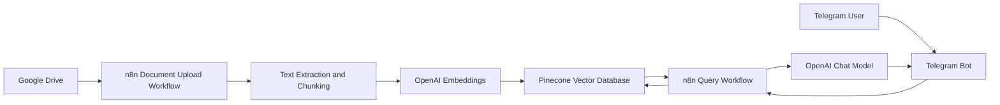
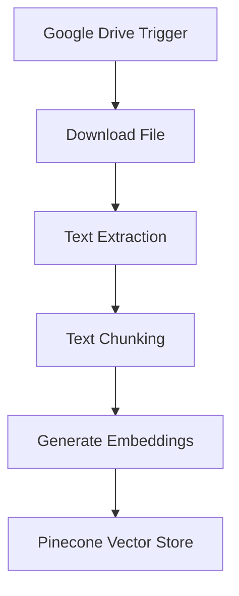
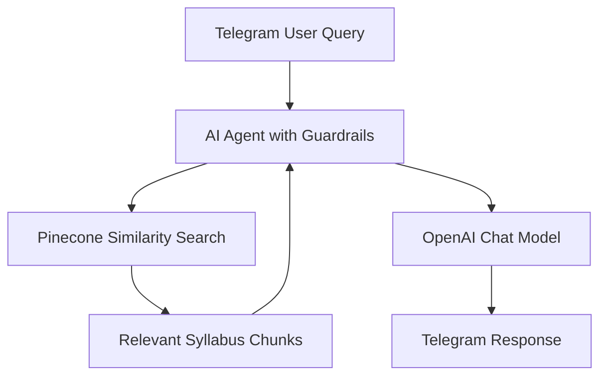
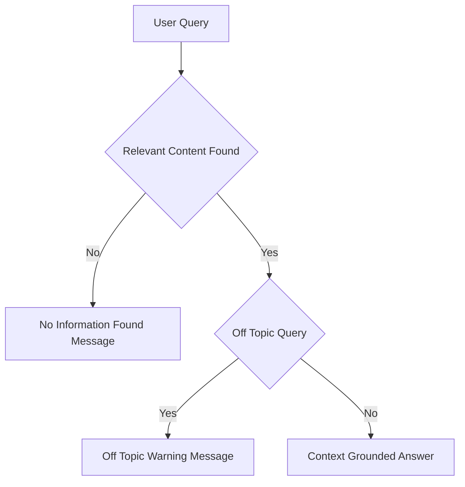

# 📘 API Manual Helper (RAG-based)

A Retrieval-Augmented Generation (RAG) chatbot that answers API related questions strictly from uploaded API manual documents using **n8n**, **OpenAI**, **Pinecone**, **Google Drive**, and **Telegram**.

---


## 🔍 Overview

API Manual Helper enables product teams, platform engineers, solution architects, and external developers who work with complex APIs. It enables users to query uploaded API manuals and technical reference documents to quickly retrieve accurate information.  
It ingests API manuals from Google Drive, converts them into searchable vector embeddings, and retrieves only relevant content to generate grounded responses.  
Strict guardrails ensure that the bot does not hallucinate or answer off-topic queries.

---

## 🏗️ System Architecture

### High-Level Architecture



## ⚙️ Workflow 1: Document Upload → Chunk → Embed → Store

**Purpose:** Convert API manual documents into a searchable vector knowledge base.



### Description

- Google Drive trigger monitors API manual uploads
- Files are downloaded and parsed
- Text is chunked into logical sections
- Each chunk is embedded using OpenAI
- Vectors and metadata are stored in Pinecone

## 💬 Workflow 2: Telegram Query → Search → Respond

**Purpose:** Answer API related questions using retrieved context only.



## 🔐 Guardrails and Response Control



### Enforced Rules

- Answers generated only from retrieved API manual chunks
- No external knowledge or inference
- Off-topic queries are rejected
- Missing-context queries return deterministic fallback messages

## 🧰 Tech Stack

- Workflow Orchestration: n8n
- Vector Database: Pinecone
- LLM and Embeddings: OpenAI
- Document Storage: Google Drive
- Chat Interface: Telegram

## 📂 Repository Structure

```text
.
├── JSON/
│   ├── amh_document_upload_flow.json     # n8n workflow for API manual ingestion
│   └── amh_telegram_bot_flow.json        # n8n workflow for Telegram Q&A
│
├── Sample_Files/
│   ├── example_apimanual1.pdf            # Sample API manual uploaded to Google Drive
│   └── example_apimanual2.pdf            # Sample API manual uploaded to Google Drive
│
├── Demo/
│   └── Demo_API_Manual_Helper.mp4        # Demo showing Telegram query responses
│
└── README.md                             # Project documentation                    
```

## 🚀 Setup Notes

- Configure credentials in n8n for Google Drive, OpenAI, Pinecone, Telegram
- Upload the sample files to the Google drive
- Import the json files to n8n
- Use the same Pinecone index in both workflows
- Activate document ingestion before enabling the Telegram bot

## 📌 Use Cases

- API endpoint discovery
- Request and response schema clarification
- Authentication and error code lookup
- Internal API governance

## ⚠️ Limitations

- Answers are limited strictly to uploaded API documentation
- Scanned documents require OCR for best results
- Not intended for general programming or design advice

## 📄 License

- This project is intended for educational, internal, and demonstration use.
- Adapt and extend as required for production deployments.
