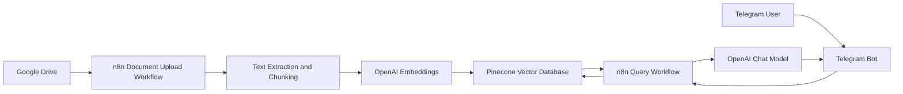
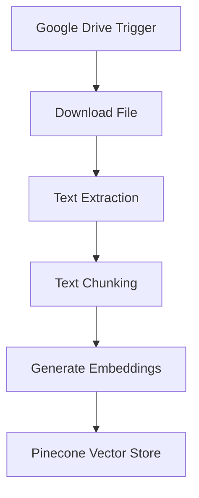
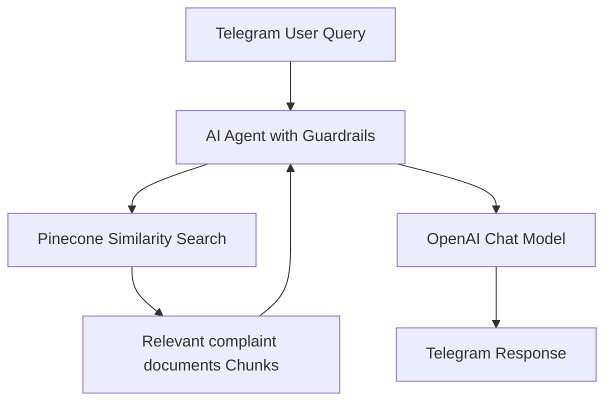
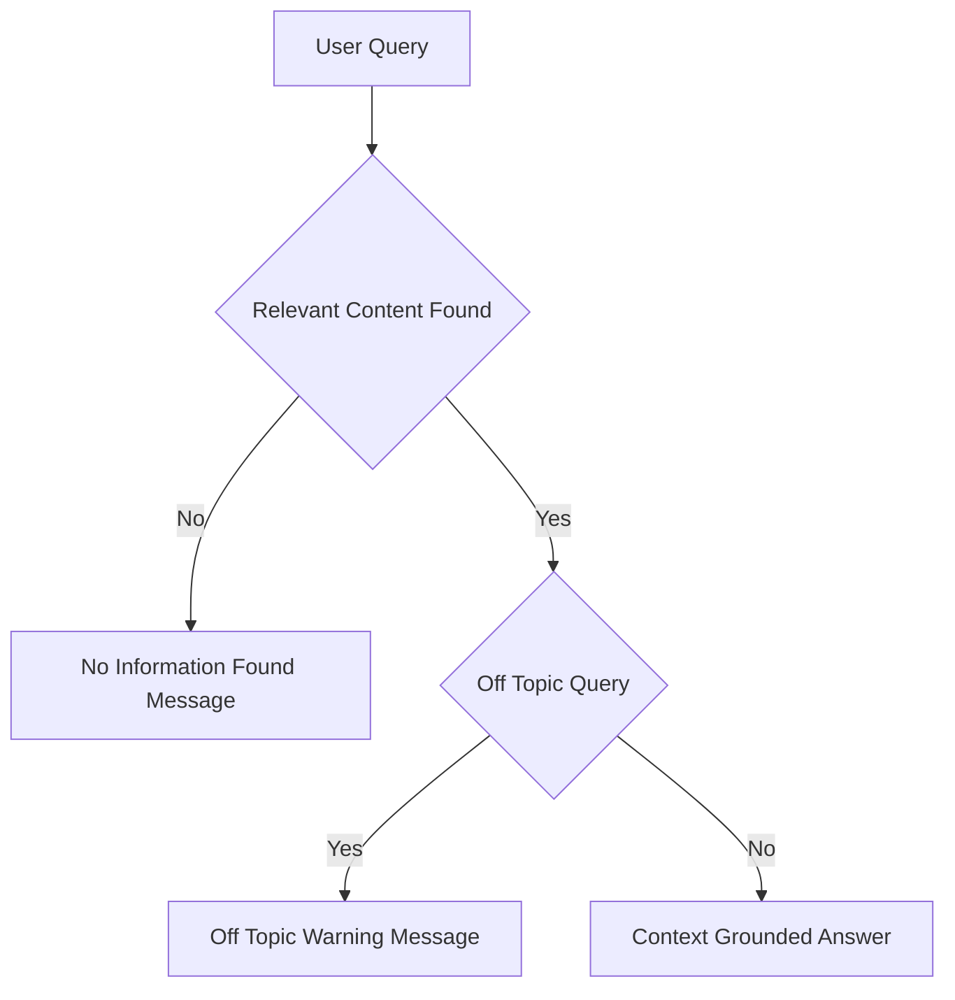

# 📘 Compliant Routing Bot

Complaint Routing Bot is a complaint classification and routing system that analyzes uploaded complaint documents and routes them to the appropriate teams or systems using **n8n**, **OpenAI**, **Pinecone**, **Google Drive**, and **Telegram**

---

## 🔍 Overview

Complaint Routing Bot enables organizations to automatically process and route complaints received as documents. It ingests complaint documents, extracts and analyzes the content to identify complaint type, category, urgency, and key metadata, and routes each complaint to the correct queue or department.
Strong guardrails ensure consistent handling, auditability, and SLA compliance without manual document review. 

---

## 🏗️ System Architecture

### High-Level Architecture



## ⚙️ Workflow 1: Document Upload → Chunk → Embed → Store

**Purpose:** Automatically monitors the Google drive folder for new copliant file uploads and converts complaint documents into a searchable vector knowledge base for semantic retrieval. 



### Description

- Google Drive trigger monitors complaint docs folder for new files upload
- Files are downloaded and parsed
- Text is chunked into logical sections
- Each chunk is embedded using OpenAI
- Vectors and metadata are stored in Pinecone

## 💬 Workflow 2: Telegram Query → Search → Respond

**Purpose:** Allows users to ask complaint-related questions via Telegram and receive answers only from indexed complaint documentation.



## 🔐 Guardrails and Response Control



### Enforced Rules

- Answers generated only from retrieved complaint documents chunks
- No external knowledge or inference
- Off-topic queries are rejected
- Missing-context queries return deterministic fallback messages

## 🧰 Tech Stack

- Workflow Orchestration: n8n
- Vector Database: Pinecone
- LLM and Embeddings: OpenAI
- Document Storage: Google Drive
- Chat Interface: Telegram

## 📂 Repository Structure

```text
.
├── JSON/
│   ├── crb_document_upload_flow.json         # n8n workflow for complaint documents ingestion
│   └── crb_telegram_bot_flow.json            # n8n workflow for Telegram Q&A
│
├── Sample_Files/
│   ├── example_complaint_doc1.csv            # Sample complaint document uploaded to Google Drive
│   └── example_complaint_doc2.csv            # Sample complaint document uploaded to Google Drive
│
├── Demo/
│   └── Demo_Complaint_Routing_Bot.mp4        # Demo showing Telegram query responses
│
└── README.md                                 # Project documentation                    
```

## 🚀 Setup Notes

- Configure credentials in n8n for Google Drive, OpenAI, Pinecone, Telegram
- Upload the sample files to the Google drive
- Import the json files to n8n
- Use the same Pinecone index in both workflows
- Activate document ingestion before enabling the Telegram bot

## 📌 Use Cases

- Banking and financial services regulatory complaints
- Telecom and utility service grievance documents
- Insurance claim disputes and escalations
- Healthcare patient complaint records
- Public sector citizen grievance documents

## ⚠️ Limitations

- Classification accuracy depends on document quality
- OCR quality impacts scanned documents
- Requires periodic tuning as complaint categories evolve
- Human resolution systems remain necessary

## 📄 License

- This project is intended for educational, internal, and demonstration use.
- Adapt and extend as required for production deployments.
