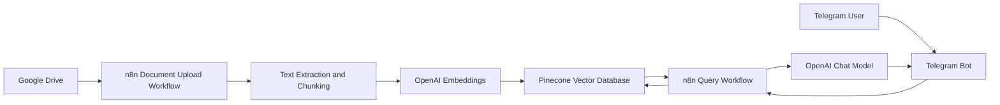
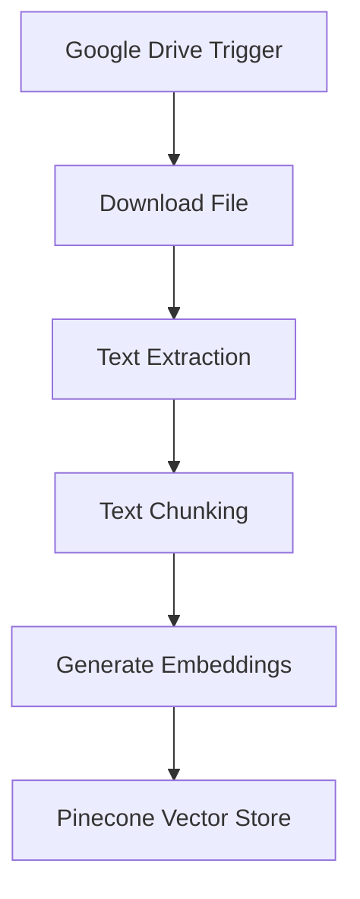
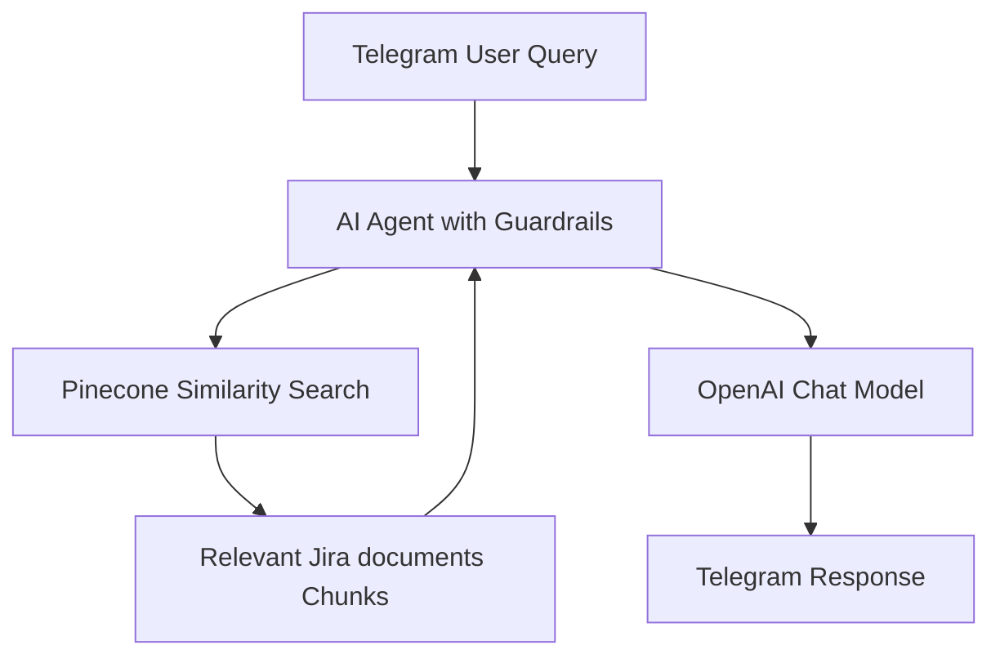
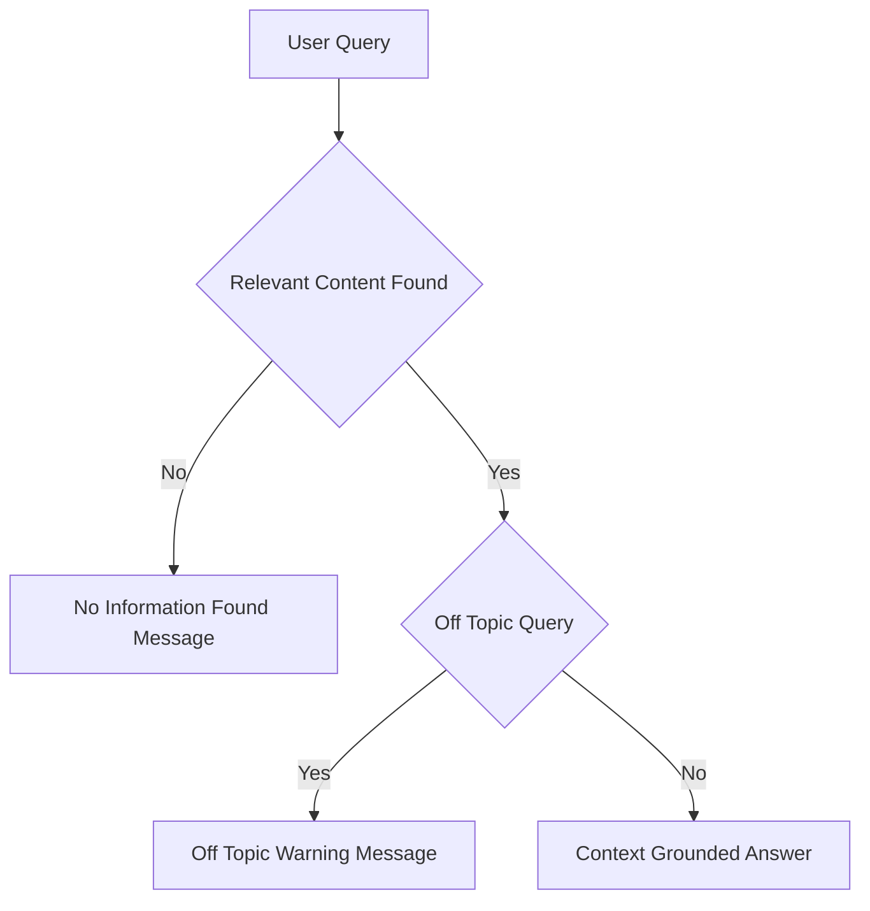

# 📘 Jira Docs Helper

 Jira documentation assistant that answers Jira related questions strictly from uploaded Jira related documents using **n8n**, **OpenAI**, **Pinecone**, **Google Drive**, and **Telegram**.

---

## 🔍 Overview

Jira Docs Helper enables teams to upload interal Jira artifacts (workflows, issue types, configurations, automation rules, SOPs) and query them via Telegram.
It ingests API manuals from Google Drive, converts them into searchable vector embeddings, and retrieves only relevant content to generate grounded responses.  
Strict guardrails ensure that the bot does not hallucinate or answer off-topic queries.

---

## 🏗️ System Architecture

### High-Level Architecture



## ⚙️ Workflow 1: Document Upload → Chunk → Embed → Store

**Purpose:** Automatically monitors the Google drive folder for new file uploads and converts Jira documents into a searchable vector knowledge base for semantic retrieval. 



### Description

- Google Drive trigger monitors Jira docs folder for new files upload
- Files are downloaded and parsed
- Text is chunked into logical sections
- Each chunk is embedded using OpenAI
- Vectors and metadata are stored in Pinecone

## 💬 Workflow 2: Telegram Query → Search → Respond

**Purpose:** Allows users to ask Jira-related questions via Telegram and receive answers only from indexed Jira documentation.



## 🔐 Guardrails and Response Control



### Enforced Rules

- Answers generated only from retrieved Jira documents chunks
- No external knowledge or inference
- Off-topic queries are rejected
- Missing-context queries return deterministic fallback messages

## 🧰 Tech Stack

- Workflow Orchestration: n8n
- Vector Database: Pinecone
- LLM and Embeddings: OpenAI
- Document Storage: Google Drive
- Chat Interface: Telegram

## 📂 Repository Structure

```text
.
├── JSON/
│   ├── jdh_document_upload_flow.json     # n8n workflow for Jira documents ingestion
│   └── jdh_telegram_bot_flow.json        # n8n workflow for Telegram Q&A
│
├── Sample_Files/
│   ├── example_jira_doc1.csv            # Sample Jira document uploaded to Google Drive
│   └── example_jira_doc2.csv            # Sample Jira document uploaded to Google Drive
│
├── Demo/
│   └── Demo_Jira_Docs_Helper.mp4        # Demo showing Telegram query responses
│
└── README.md                            # Project documentation                    
```

## 🚀 Setup Notes

- Configure credentials in n8n for Google Drive, OpenAI, Pinecone, Telegram
- Upload the sample files to the Google drive
- Import the json files to n8n
- Use the same Pinecone index in both workflows
- Activate document ingestion before enabling the Telegram bot

## 📌 Use Cases

- Jira onboarding assistant
- Internal Jira knowledge base
- Process & workflow reference bot
- Compliance safe AI documentation search
- Enterprise RAG proof-of-concept(POC)

## ⚠️ Limitations

- Answers are limited strictly to uploaded Jira documentation.
- Output quality depends entirely on document quality and completeness.
- Does not support live Jira data or Jira API integration.
- Cannot infer or connect information not explicitly documented.
- Retrieval may be weak for vague or overly broad queries.
- Chunking can miss cross-document context in complex workflows.
- Conversational memory is intentionally minimal.
- No built-in document versioning or change tracking.

## 📄 License

- This project is intended for educational, internal, and demonstration use.
- Adapt and extend as required for production deployments.
