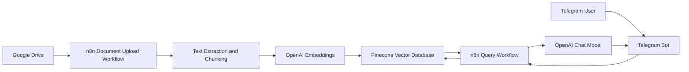
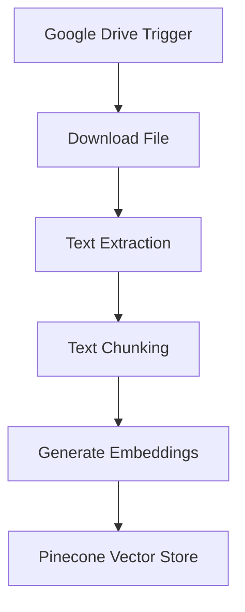
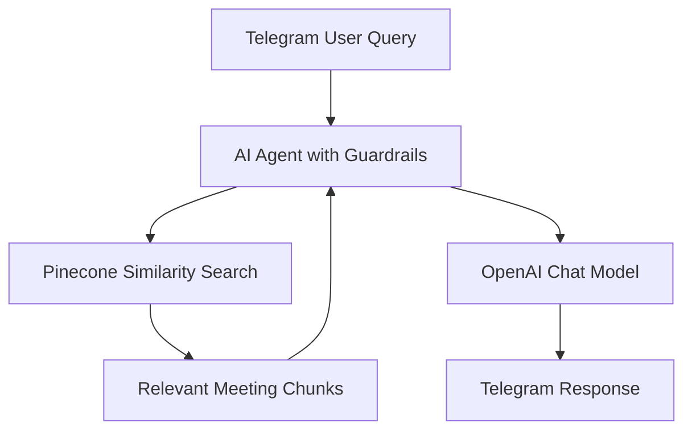
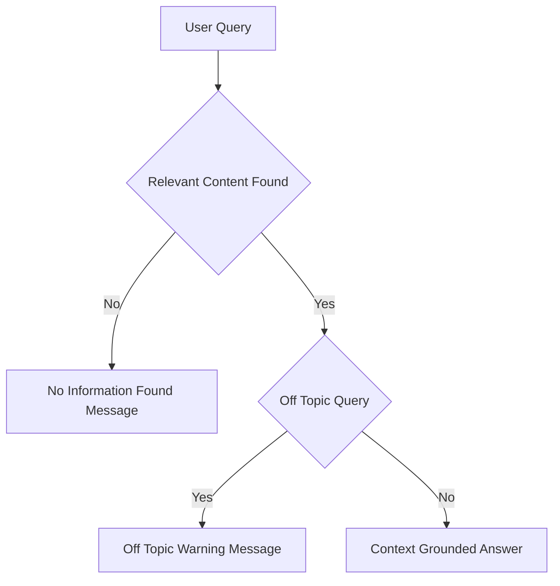

# 📘 Meeting Summary Bot (RAG-based)

Meeting Summary bot that answers meeting related questions strictly from uploaded meeting content using **n8n**, **OpenAI**, **Pinecone**, **Google Drive**, and **Telegram**.

---


## 🔍 Overview

Meeting Summary Bot is designed for organizations across corporate, consulting, and professional services industries that conduct frequent virtual or in-person meetings. It ingests meeting artifacts such as transcripts, chat logs, and presentation notes from Google Drive, converts them into searchable vector embeddings, and retrieves only relevant content to generate grounded responses.  
Strict guardrails ensure that the bot does not hallucinate or answer off-topic queries.

---

## 🏗️ System Architecture

### High-Level Architecture



## ⚙️ Workflow 1: Document Upload → Chunk → Embed → Store

**Purpose:** Coverts meeting transcripts and notes into searchable knowledge base (Meeting content Ingestion)



### Description

- Meeting transcripts or notes are uploaded to a designated Google Drive folder.
- Google Drive trigger detects new uploads and downloads the files.
- Files are downloaded and parsed
- Content is split into logical chunks (by speaker turns or sections).
- Each chunk is converted into vector embeddings using OpenAI.
- Embeddings and metadata are stored in a Pinecone index.


## 💬 Workflow 2: Telegram Query → Search → Respond

**Purpose:** Answer meeting related questions using retrieved meeting content only.



## 🔐 Guardrails and Response Control



### Enforced Rules

- Answers generated only from retrieved meeting content
- No external knowledge or inference
- Off-topic queries are rejected
- Missing-context queries return deterministic fallback messages

## 🧰 Tech Stack

- Workflow Orchestration: n8n
- Vector Database: Pinecone
- LLM and Embeddings: OpenAI
- Document Storage: Google Drive
- Chat Interface: Telegram

## 📂 Repository Structure

```text
.
├── JSON/
│   ├── msb_document_upload_flow.json     # n8n workflow for meeting content ingestion
│   └── msb_telegram_bot_flow.json        # n8n workflow for Telegram Q&A
│
├── Sample_Files/
│   ├── example_meeting1.txt              # Sample meeting content uploaded to Google Drive
│   └── example_meeting2.csv              # Sample meeting content uploaded to Google Drive
│
├── Demo/
│   └── Demo_Meeting_Summary_Bot.mp4      # Demo showing Telegram query responses
│
└── README.md                             # Project documentation                    
```

## 🚀 Setup Notes

- Configure credentials in n8n for Google Drive, OpenAI, Pinecone, Telegram
- Upload the sample files to the Google drive
- Import the json files to n8n
- Use the same Pinecone index in both workflows
- Activate document ingestion before enabling the Telegram bot

## 📌 Use Cases

- Leadership and executive meetings
- Project and sprint review meetings
- Sales and client calls
- Technical design and architecture discussions
- Compliance and audit documentation


## ⚠️ Limitations

- Summary quality depends on transcript accuracy.
- Scanned or poor-quality transcripts may require preprocessing.
- Does not replace officially approved meeting minutes.
- Not designed for sentiment analysis or performance evaluation.


## 📄 License

- This project is intended for educational, internal, and demonstration use.
- Adapt and extend as required for production deployments.
