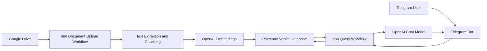
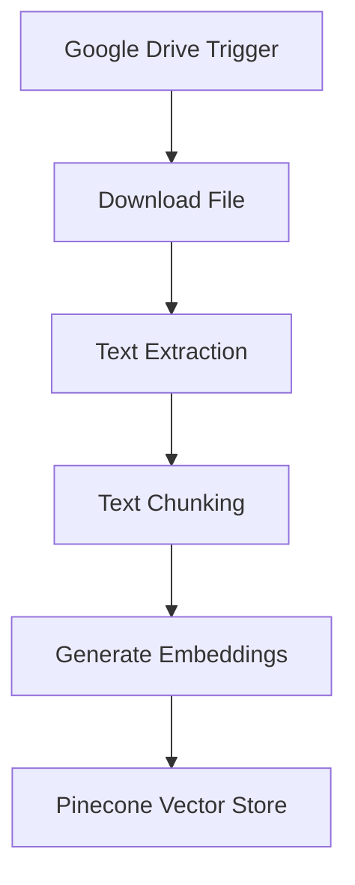
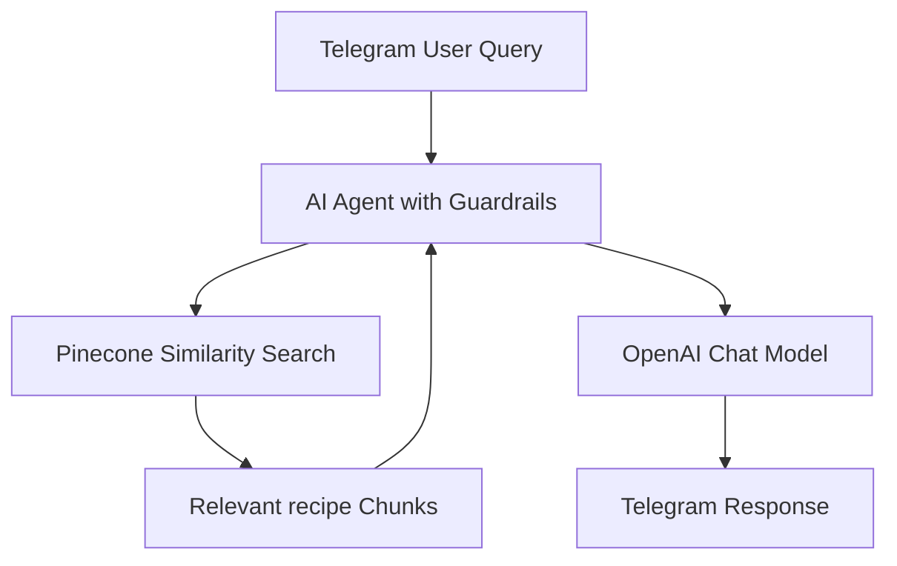
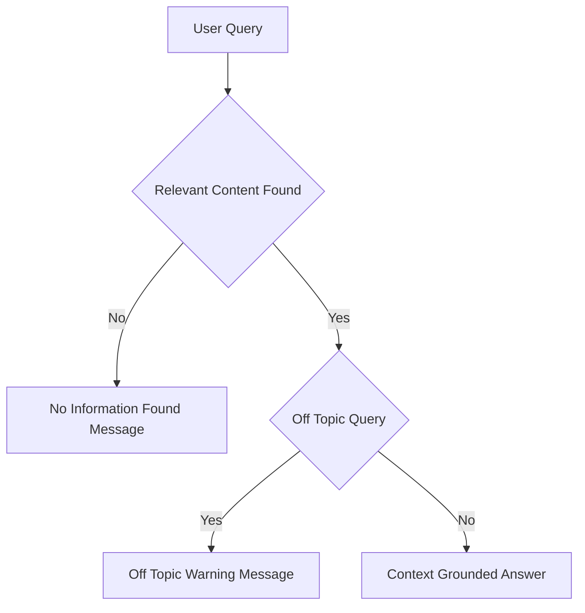

# 📘 Recipe Recommender Bot (RAG-based)

A Retrieval-Augmented Generation (RAG) chatbot that recommends and retrieves recipes strictly from uploaded recipe documentations using **n8n**, **OpenAI**, **Pinecone**, **Google Drive**, and **Telegram**.

---

## 🔍 Overview

Recipe Recommender Bot enables users to query recipe documents conversationally via Telegram.
It ingests curated recipe collections from Google Drive, converts them into searchable vector embeddings, and retrieves only relevant recipe content to generate grounded responses.
Strict guardrails ensure the assistant does not hallucinate ingredients, steps, substitutions, or recipes beyond the uploaded documentation.

---

## 🏗️ System Architecture

### High-Level Architecture



## ⚙️ Workflow 1: Document Upload → Chunk → Embed → Store

**Purpose:** Convert recipe documents into a searchable vector knowledge base.



### Description

- Google Drive trigger monitors recipe document uploads
- Files are downloaded and parsed
- Text is chunked into logical sections
- Each chunk is embedded using OpenAI
- Vectors and metadata are stored in Pinecone

## 💬 Workflow 2: Telegram Query → Search → Respond

**Purpose:** Answer recipe related questions using retrieved context only.



## 🔐 Guardrails and Response Control



### Enforced Rules

- Answers generated only from retrieved recipe document chunks
- No external knowledge or inference
- Off-topic queries are rejected
- Missing-context queries return deterministic fallback messages

## 🧰 Tech Stack

- Workflow Orchestration: n8n
- Vector Database: Pinecone
- LLM and Embeddings: OpenAI
- Document Storage: Google Drive
- Chat Interface: Telegram

## 📂 Repository Structure

```text
.
├── JSON/
│   ├── rrb_document_upload_flow.json     # n8n workflow for recipe documents ingestion
│   └── rrb_telegram_bot_flow.json        # n8n workflow for Telegram Q&A
│
├── Sample_Files/
│   ├── example_recipe_doc1.csv           # Sample recipe document uploaded to Google Drive
│   └── example_recipe_doc2.csv           # Sample recipe document uploaded to Google Drive
│
├── Demo/
│   └── Demo_Recipe_Recommender_Bot.mp4   # Demo showing Telegram query responses
│
└── README.md                             # Project documentation                    
```

## 🚀 Setup Notes

- Configure credentials in n8n for Google Drive, OpenAI, Pinecone, Telegram
- Upload the sample files to the Google drive
- Import the json files to n8n
- Use the same Pinecone index in both workflows
- Activate document ingestion before enabling the Telegram bot

## 📌 Use Cases

- Recipe discovery by ingredients or cuisine
- Dietary-compliant recipe lookup (vegan, gluten-free, etc.)
- Kitchen and culinary team knowledge access
- Food platform and content management systems

## ⚠️ Limitations

- Answers limited strictly to uploaded recipe documents
- No ingredient substitutions or cooking advice
- Not a general cooking assistant

## 📄 License

- For educational and internal institutional use.
- Adaptable for production deployments.
