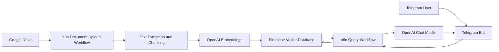
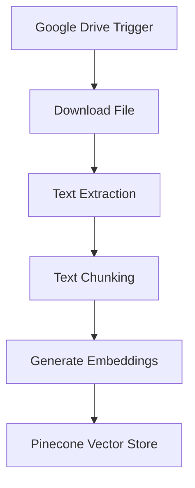
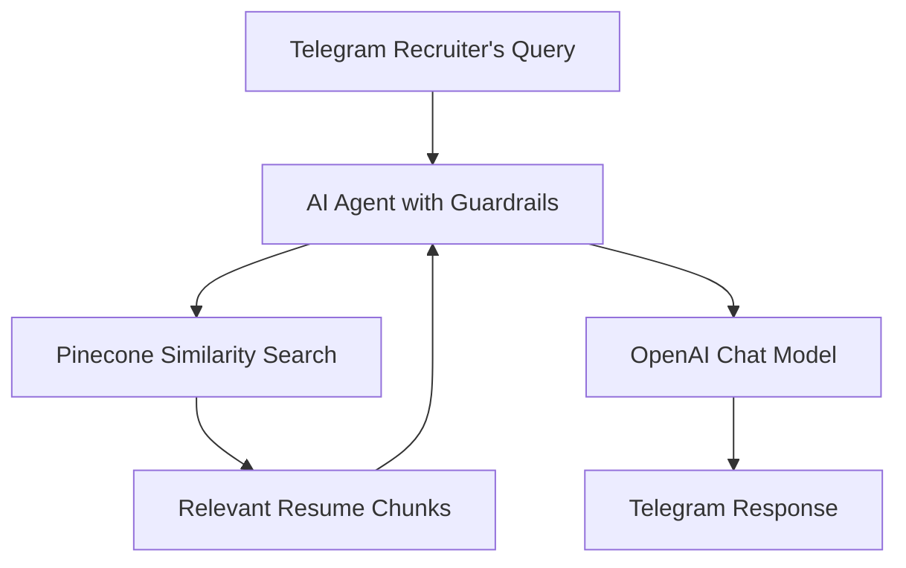
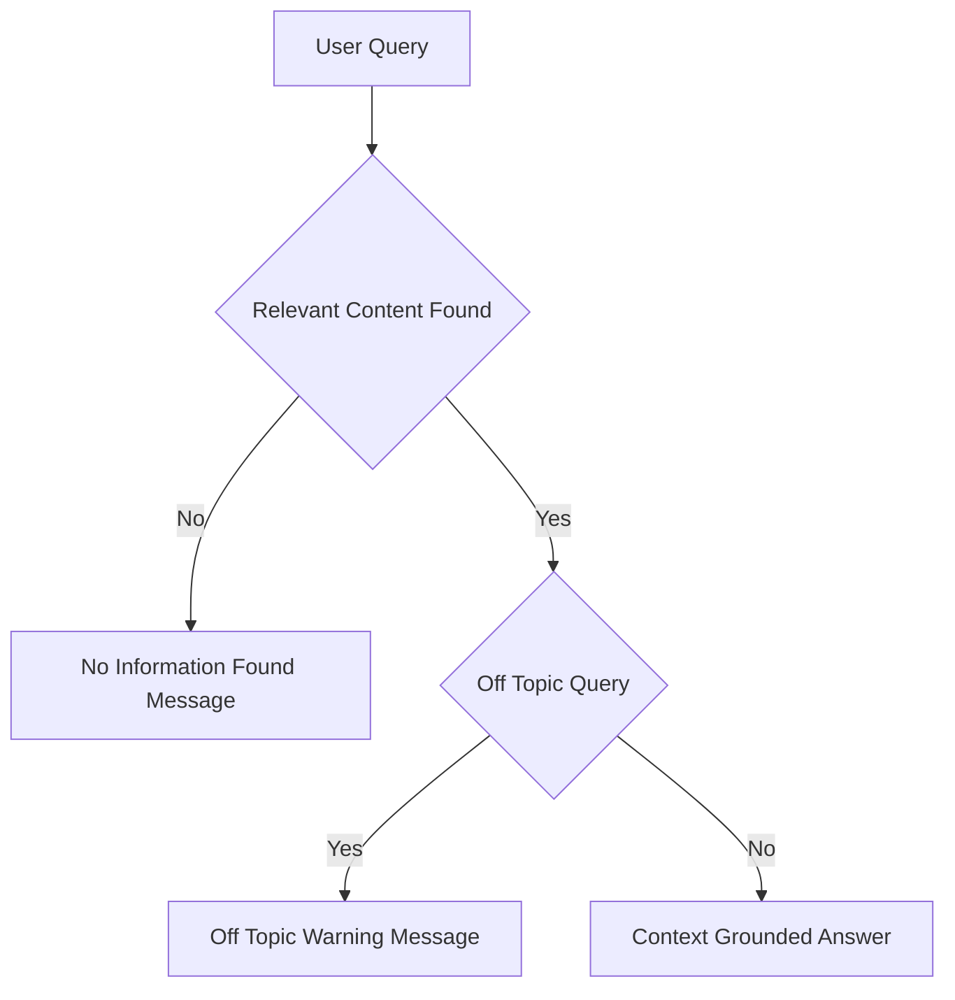

# 📘 Resume Finder Bot (RAG-based)

Resume Finder Bot enables recruiters and hiring teams to search, filter, and summarize candidates resumes strictly from uploaded resume documents using **n8n**, **OpenAI**, **Pinecone**, **Google Drive**, and **Telegram**.

---


## 🔍 Overview

Resume Finder Bot helps organizations efficiently identify relevant candidates from large resume repositories. Resumes uploaded to Google Drive are ingested, embedded, and indexed in Pinecone, allowing recruiters to query candidate profiles conversationally via Telegram.
The bot enforces strict document-grounded guardrails, ensuring that all responses are derived only from resume content without assumptions, bias, or external knowledge..

---

## 🏗️ System Architecture

### High-Level Architecture



## ⚙️ Workflow 1: Document Upload → Chunk → Embed → Store

**Purpose:** Convert resumes into a searchable vector knowledge base.



### Description

- Candidate resumes are uploaded to a designated Google Drive folder. Google Drive trigger detects new uploads and downloads the files.
- Resume text is extracted from PDF and DOCX formats.
- Content is split into logical sections (skills, experience, education).
- Each chunk is converted into embeddings using OpenAI.
- Embeddings and metadata are stored in a Pinecone index.

## 💬 Workflow 2: Resume Search → Retrieve → Respond

**Purpose:** Retrieve and summarize candidate information strictly from resumes.



## 🔐 Guardrails and Response Control



## 🧰 Tech Stack

- Workflow Orchestration: n8n
- Vector Database: Pinecone
- LLM and Embeddings: OpenAI
- Document Storage: Google Drive
- Chat Interface: Telegram

## 📂 Repository Structure

```text
.
├── JSON/
│   ├── rfb_document_upload_flow.json     # n8n workflow for resumes ingestion
│   └── rfb_telegram_bot_flow.json        # n8n workflow for Telegram Q&A
│
├── Sample_Files/
│   ├── example_resume1.pdf               # Sample resume of candidate1 uploaded to Google Drive
│   └── example_resume2.pdf               # Sample resume of candidate2 uploaded to Google Drive
│
├── Demo/
│   └── Demo_Resume_Finder_Bot.mp4        # Demo showing Telegram query responses
│
└── README.md                             # Project documentation                    
```

## 🚀 Setup Notes

- Configure credentials in n8n for Google Drive, OpenAI, Pinecone, Telegram
- Upload the sample files to the Google drive
- Import the json files to n8n
- Use the same Pinecone index in both workflows
- Activate document ingestion before enabling the Telegram bot

## 📌 Use Cases

- Resume search and filtering
- Candidate shortlisting
- Internal talent discovery
- Recruitment analytics support
- Staffing and consulting workflows

## ⚠️ Limitations

- Output quality depends on resume clarity and structure.
- Scanned resumes may require OCR preprocessing.
- The bot does not rank or score candidates unless explicitly configured.
- Not a replacement for human hiring decisions.

## 📄 License

- This project is intended for educational, internal, and demonstration use.
- Adapt and extend as required for producti
