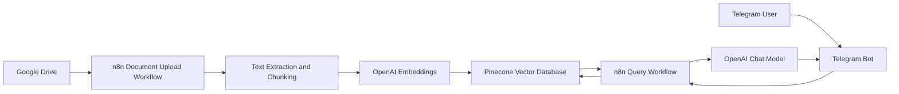
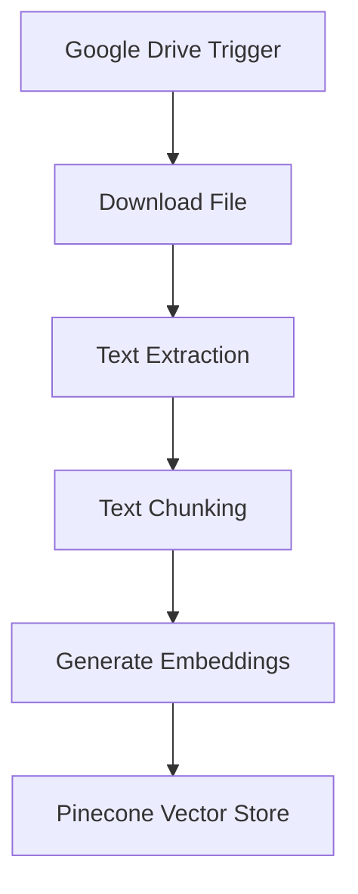
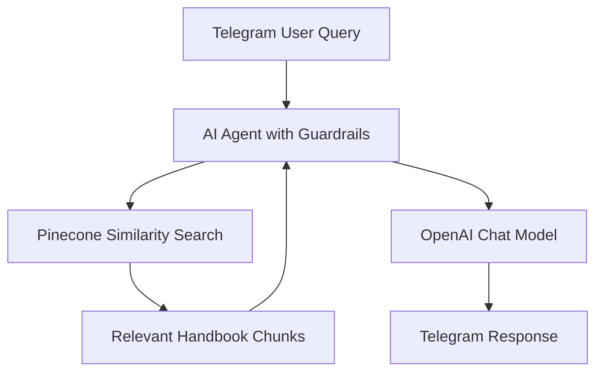
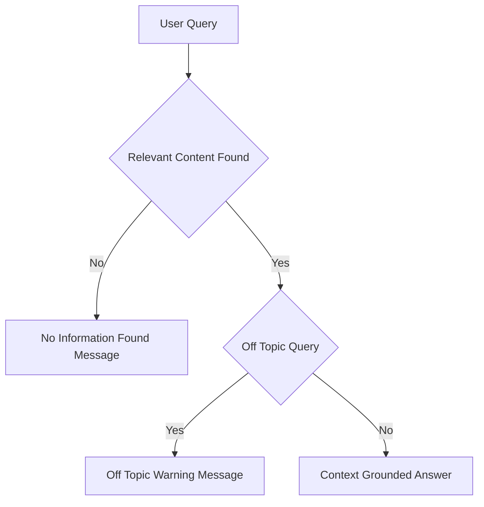

# 📘 Student Handbook Assistant

 Student Handbook Assistant answers student-related questions strictly from approved student handbook documents using **n8n**, **OpenAI**, **Pinecone**, **Google Drive**, and **Telegram**.

---

## 🔍 Overview

Student Handbook Assistant helps students quickly access accurate and consistent information from official student handbooks and related institutional documents. It ingests approved documents such as academic policies, codes of conduct, attendance rules, grading systems, campus facilities, and student services, converts them into searchable vector embeddings, and retrieves only relevant sections to generate grounded responses.
Strict guardrails ensure the assistant does not infer, interpret, or provide guidance beyond the documented policies.

---

## 🏗️ System Architecture

### High-Level Architecture



## ⚙️ Workflow 1: Document Upload → Chunk → Embed → Store

**Purpose:** Automatically monitors the Google drive folder for new file uploads and converts student handbook documents into a searchable vector knowledge base for semantic retrieval. 



### Description

- Google Drive trigger monitors student handbook docs folder for new files upload
- Files are downloaded and parsed
- Text is chunked into logical sections
- Each chunk is embedded using OpenAI
- Vectors and metadata are stored in Pinecone

## 💬 Workflow 2: Telegram Query → Search → Respond

**Purpose:** Allows users to ask student handbook-related questions via Telegram and receive answers only from indexed student handbook documentation.



## 🔐 Guardrails and Response Control



### Enforced Rules

- Responses generated only from retrieved student handbook chunks
- No external knowledge, interpretation, or advisory content
- Off-topic queries rejected with deterministic messages
- Missing-context queries return predefined fallback responses

## 🧰 Tech Stack

- Workflow Orchestration: n8n
- Vector Database: Pinecone
- LLM and Embeddings: OpenAI
- Document Storage: Google Drive
- Chat Interface: Telegram

## 📂 Repository Structure

```text
.
├── JSON/
│   ├── sha_document_upload_flow.json                # n8n workflow for student handbook documents ingestion
│   └── sha_telegram_bot_flow.json                   # n8n workflow for Telegram Q&A
│
├── Sample_Files/
│   ├── example_student handbook_doc1.pdf            # Sample student handbook document uploaded to Google Drive
│   └── example_student handbook_doc2.pdf            # Sample student handbook document uploaded to Google Drive
│
├── Demo/
│   └── Demo_Student_Handbook_Assistant.mp4          # Demo showing Telegram query responses
│
└── README.md                                        # Project documentation                    
```

## 🚀 Setup Notes

- Configure credentials in n8n for Google Drive, OpenAI, Pinecone, Telegram
- Upload the sample files to the Google drive
- Import the json files to n8n
- Use the same Pinecone index in both workflows
- Activate document ingestion before enabling the Telegram bot

## 📌 Use Cases

- Academic policy clarification
- Code of conduct and disciplinary rules
- Attendance and grading system queries
- Campus facilities and student services reference
- Administrative helpdesk support

## ⚠️ Limitations

- Answers strictly limited to uploaded handbook documents
- OCR required for scanned or image-based handbooks
- Does not replace academic advisors or counselors
- Requires document updates to reflect policy changes

## 📄 License

- This project is intended for educational, internal, and demonstration use.
- Adapt and extend as required for production deployments
