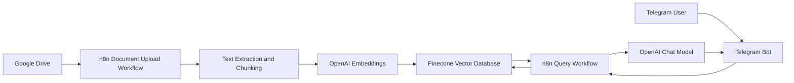
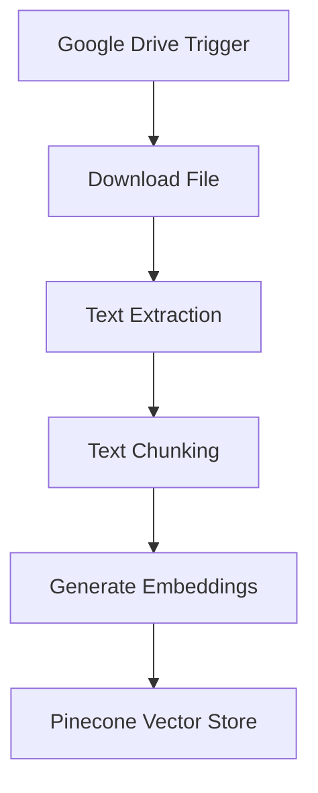
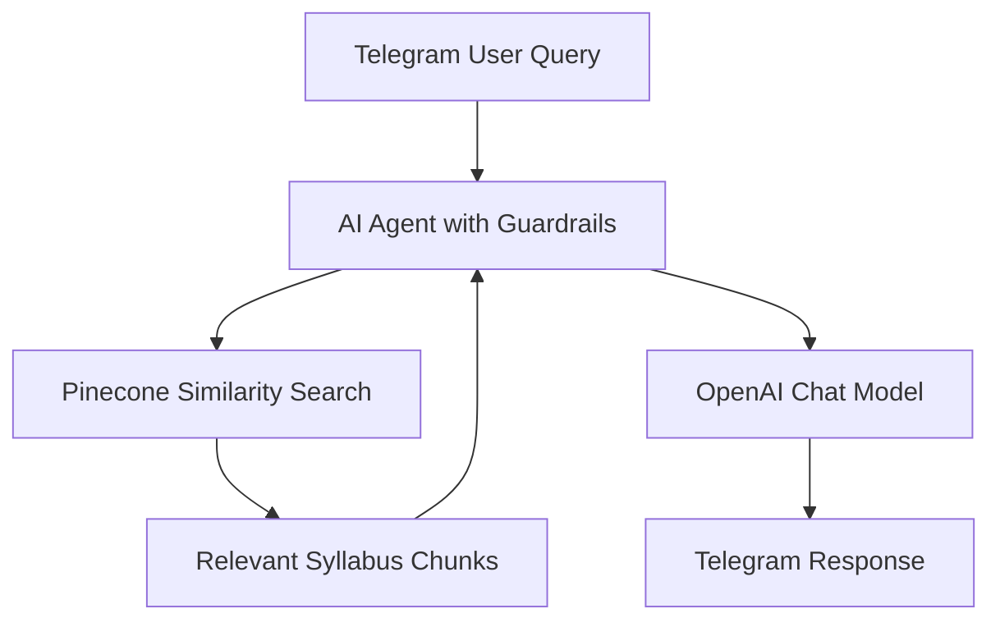
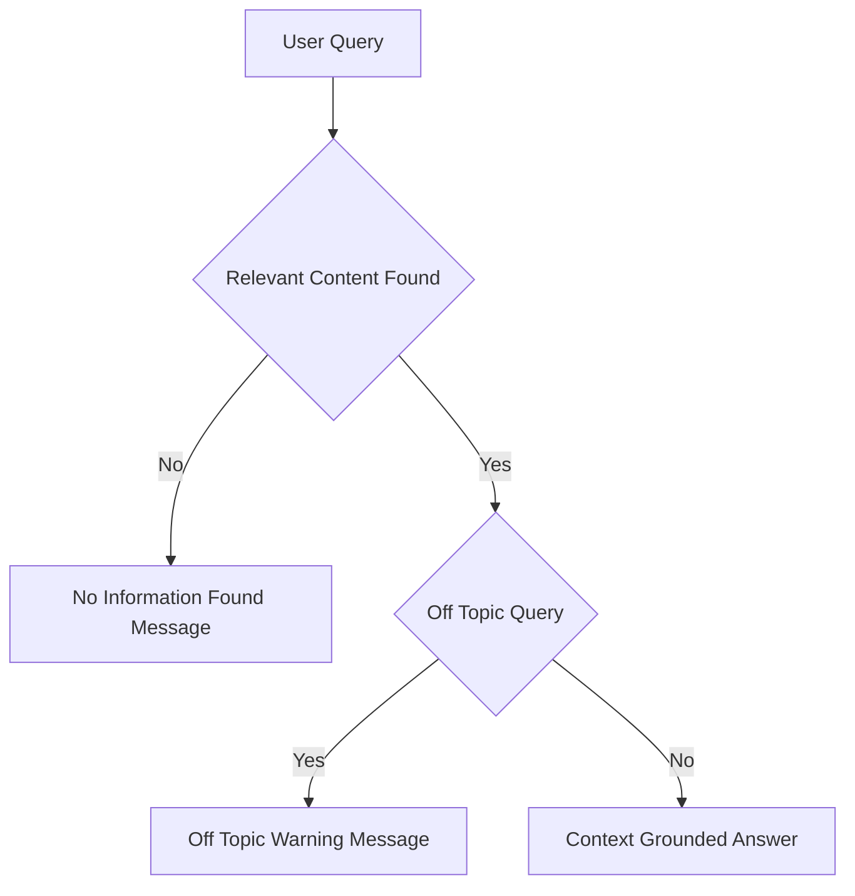

# 📘 Syllabus Advisor Bot (RAG-based)

A Retrieval-Augmented Generation (RAG) chatbot that answers syllabus-related questions strictly from uploaded academic documents using **n8n**, **OpenAI**, **Pinecone**, **Google Drive**, and **Telegram**.

---

## 🔍 Overview

Syllabus Advisor Bot enables students, faculty, and academic administrators to query syllabus documents conversationally via Telegram.  
It ingests syllabus files from Google Drive, converts them into searchable vector embeddings, and retrieves only relevant content to generate grounded responses.  
Strict guardrails ensure that the bot does not hallucinate or answer off-topic queries.

---

## 🏗️ System Architecture

### High-Level Architecture



## ⚙️ Workflow 1: Document Upload → Chunk → Embed → Store

**Purpose:** Convert syllabus documents into a searchable vector knowledge base.



### Description

- Google Drive trigger monitors syllabus uploads
- Files are downloaded and parsed
- Text is chunked into logical sections
- Each chunk is embedded using OpenAI
- Vectors and metadata are stored in Pinecone

## 💬 Workflow 2: Telegram Query → Search → Respond

**Purpose:** Answer syllabus questions using retrieved context only.



## 🔐 Guardrails and Response Control



### Enforced Rules

- Answers generated only from retrieved syllabus chunks
- No external knowledge or inference
- Off-topic queries are rejected
- Missing-context queries return deterministic fallback messages

## 🧰 Tech Stack

- Workflow Orchestration: n8n
- Vector Database: Pinecone
- LLM and Embeddings: OpenAI
- Document Storage: Google Drive
- Chat Interface: Telegram

## 📂 Repository Structure

```text
.
├── JSON/
│   ├── sab_document_upload_flow.json     # n8n workflow for syllabus ingestion
│   └── sab_telegram_bot_flow.json        # n8n workflow for Telegram Q&A
│
├── Sample_Files/
│   ├── example_syllabus1.pdf             # Sample syllabus file uploaded to Google Drive
│   └── example_syllabus2.pdf             # Sample syllabus file uploaded to Google Drive
│
├── Demo/
│   └── Demo_Syllabus_Advisor_Bot.mp4     # Demo showing Telegram query responses
│
└── README.md                             # Project documentation                    
```

## 🚀 Setup Notes

- Configure credentials in n8n for Google Drive, OpenAI, Pinecone, Telegram
- Upload the sample files to the Google drive
- Import the json files to n8n
- Use the same Pinecone index in both workflows
- Activate document ingestion before enabling the Telegram bot

## 📌 Use Cases

- Student syllabus clarification
- Faculty curriculum reference
- Academic helpdesk automation
- Accreditation support

## ⚠️ Limitations

- Answers limited strictly to uploaded documents
- OCR required for scanned PDFs
- Not a general academic advisor

## 📄 License

- For educational and internal institutional use.
- Adaptable for production deployments.
