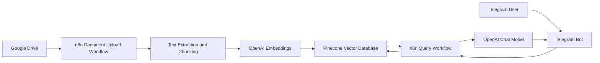
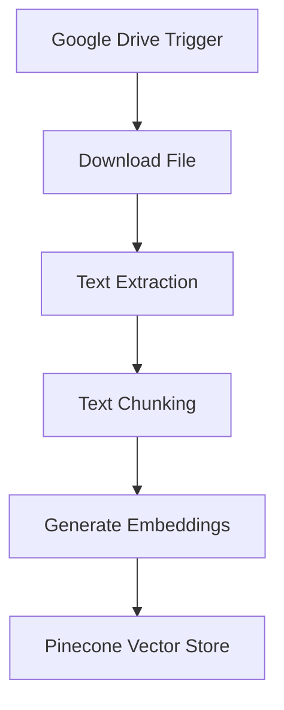
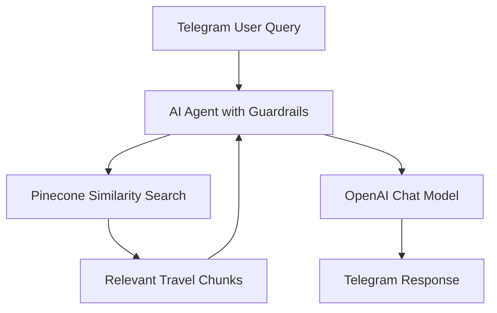
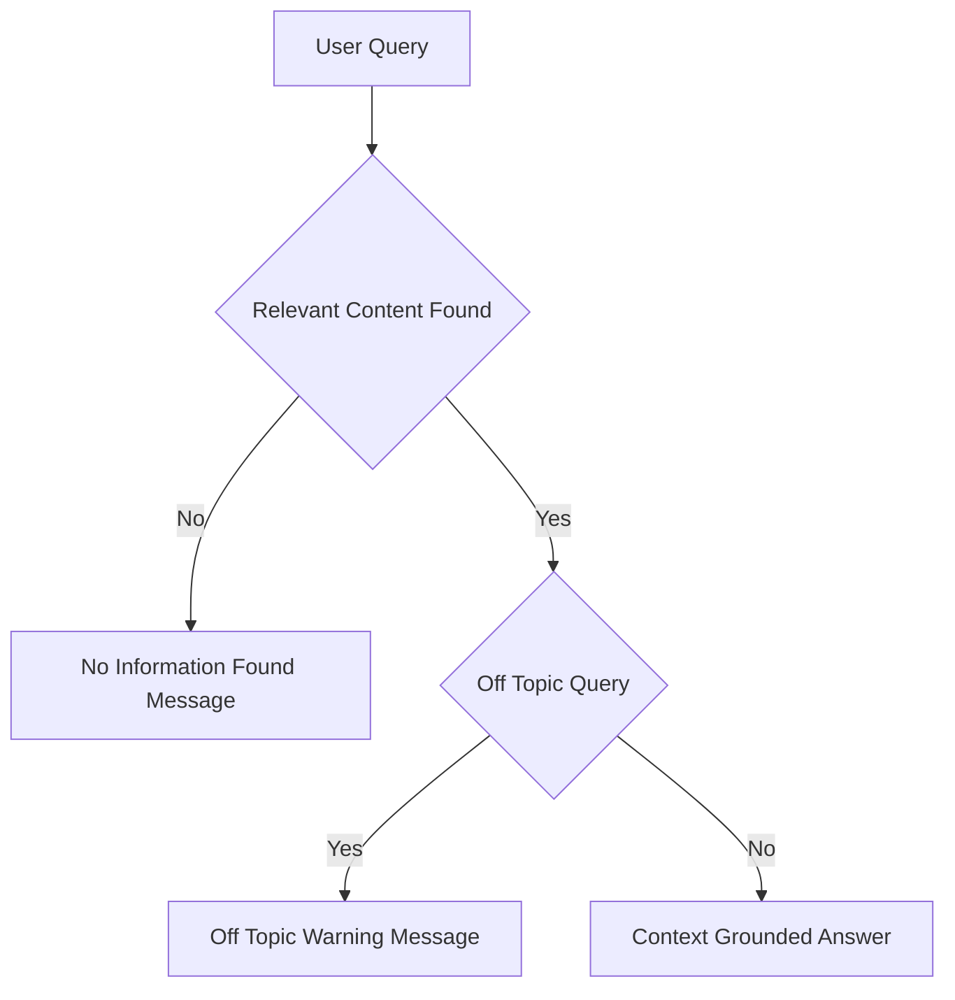

# 📘 Travel Planner Assistant (RAG-based)

A Retrieval-Augmented Generation (RAG) chatbot that answers travel-related questions strictly from uploaded travel documents using **n8n**, **OpenAI**, **Pinecone**, **Google Drive**, and **Telegram**.

---

## 🔍 Overview

Travel Planner Assistant enables users to query travel datasets conversationally via Telegram.
It ingests travel documents (destinations, itineraries, schedules, costs, transportation, accommodations) from Google Drive, converts them into searchable vector embeddings, and retrieves only relevant content to generate grounded responses.
Strict guardrails ensure that the assistant does not hallucinate, infer, or answer outside the uploaded travel documentation.

---

## 🏗️ System Architecture

### High-Level Architecture



## ⚙️ Workflow 1: Document Upload → Chunk → Embed → Store

**Purpose:** Convert travel documents into a searchable vector knowledge base.



### Description

- Google Drive trigger monitors travel document uploads
- Files are downloaded and parsed
- Text is chunked into logical sections
- Each chunk is embedded using OpenAI
- Vectors and metadata are stored in Pinecone

## 💬 Workflow 2: Telegram Query → Search → Respond

**Purpose:** Answer travel related questions using retrieved context only.



## 🔐 Guardrails and Response Control



### Enforced Rules

- Answers generated only from retrieved travel chunks
- No external knowledge or inference
- Off-topic queries are rejected
- Missing-context queries return deterministic fallback messages

## 🧰 Tech Stack

- Workflow Orchestration: n8n
- Vector Database: Pinecone
- LLM and Embeddings: OpenAI
- Document Storage: Google Drive
- Chat Interface: Telegram

## 📂 Repository Structure

```text
.
├── JSON/
│   ├── tpa_document_upload_flow.json     # n8n workflow for travel documents ingestion
│   └── tpa_telegram_bot_flow.json        # n8n workflow for Telegram Q&A
│
├── Sample_Files/
│   ├── example_travel_doc1.csv           # Sample travel document uploaded to Google Drive
│   └── example_travel_doc2.csv           # Sample travel document uploaded to Google Drive
│
├── Demo/
│   └── Demo_Travel_Planner_Assistant.mp4 # Demo showing Telegram query responses
│
└── README.md                             # Project documentation                    
```

## 🚀 Setup Notes

- Configure credentials in n8n for Google Drive, OpenAI, Pinecone, Telegram
- Upload the sample files to the Google drive
- Import the json files to n8n
- Use the same Pinecone index in both workflows
- Activate document ingestion before enabling the Telegram bot

## 📌 Use Cases

- Corporate travel information retrieval
- Travel agency itinerary lookup
- Tourism dataset exploration
- Internal travel policy reference

## ⚠️ Limitations

- Answers limited strictly to uploaded documents
- OCR required for scanned PDFs
- Not a real-time booking or advisory system

## 📄 License

- For educational and internal institutional use.
- Adaptable for production deployments.
